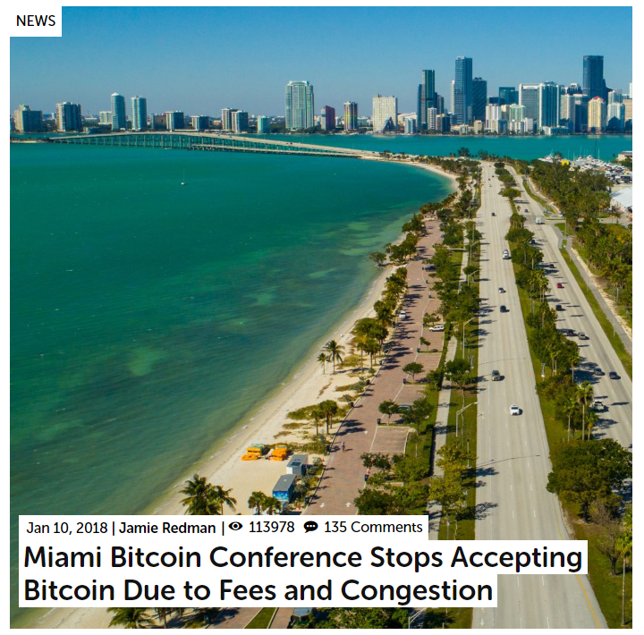
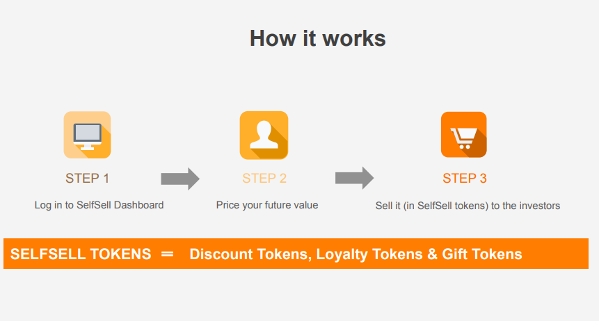

background-image: url(images/bitcoin.jpg)
background-position: 50% 50%
class: center, middle, inverse

# ¿Qué es una criptomoneda?

---

# <i class="fab fa-bitcoin"></i> ¿Qué es una criptomoneda?

## Desde el punto de vista...

--

- ... técnico **<i class="far fa-frown"></i>**

--

- ... fiscal **<i class="far fa-frown"></i> **

--

- Desde el punto de vista del **mercado** **<i class="far fa-smile"></i> **

---

## Desde el punto de vista del consumidor:
---

## ¿es un medio de pago?

 

<small><a href="https://news.bitcoin.com/miami-bitcoin-conference-stops-accepting-bitcoin-due-to-fees-and-congestion/" target="_blank">Fuente: BitCoin.com</a></small>
---
## ¿es un producto de inversión?

 

<small><a href="http://www.bbc.com/mundo/noticias-america-latina-43136611">Fuente: BBC</a></small>

---
## ¿es una experiencia?

---
## Ejemplos (I)

 
<small><a href="https://www.euribor.com.es/2018/05/22/el-jugador-del-bayern-de-munich-james-rodriguez-lanza-su-criptomoneda-para-impulsar-su-valor-de-marca/#" target="_blank">Fuente: Cinco Días</a></small>
---
## Ejemplos (I): SelfShell

 
<small><a href="https://selfsell.com/" target="_blank">Fuente: ShelfSell</a></small>
---
##  Valor de las criptomonedas para el consumidor

Distintos segmentos por motivación: 

- Como elemento de diferenciación e identificación
- Como servicio de experiencia
- No una única motivación
---
## A tener en cuenta por el regulador

- No es esperable desaparición del mercado a corto plazo
- Aparición de nichos especializados en necesidades distintas

