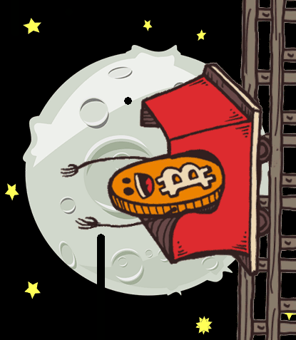
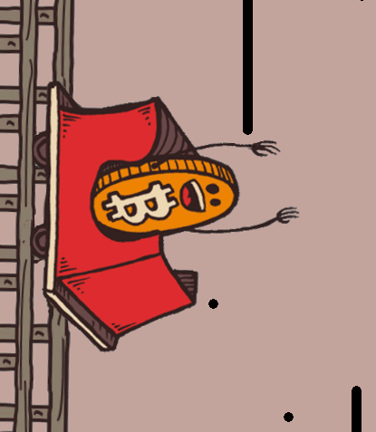

```{r, include=FALSE}
htmltools::tagList(rmarkdown::html_dependency_font_awesome())
```

background-image: url("images/bitcoin.jpg")
background-position: 50% 50%
class: left, top, inverse

# ¿Qué es una criptomoneda? 

## Desde el punto de vista...

--

## ... ~~técnico~~

--

## ... ~~fiscal~~ 

--

# Desde el punto de vista del **comprador** 
---

background-image: url("images/volumen.png")
background-position: 10% 10%
background-size: 400pt
class: rigth, bottom

<small><a href="https://coinmarketcap.com/">Fuente: CoinMarketCap</a></small>

# El mercado de criptomonedas

---

class: rigth, middle 

# Para poder entender las repercusiones legales y fiscales: 

## es necesario entender por qué se producen los intercambios en el mercado de criptomonedas

--

### Los individuos perciben que obtienen **valor** en el intercambio

### ¿de dónde viene ese valor?, ¿cuál es la motivación de compra?

---
class: middle

# 1. Como producto de inversión

--

### **<i class="fa fa-arrow-circle-right"></i>** Se espera que su valor en el futuro será mayor que el actual
### **<i class="fa fa-arrow-circle-right"></i>** "Futuro" puede ser largo, medio o corto plazo


---
class: middle, left, inverse
background-image: url("images/petro.png")
background-position: 30% 50% 

.pull-left[# Ejemplo]

.pull-right[.footnote[[Fuente: BBC](http://www.bbc.com/mundo/noticias-america-latina-43136611)]]


---
class: top, left

## El atractivo como producto de inversión a medio y largo plazo está muy condicionado por:

### **<i class="fa fa-plus-circle"></i>** el valor "intrínseco" del activo
--

### **<i class="fa fa-minus-circle"></i>** ¿seguridad? 

--

### **<i class="fa fa-minus-circle"></i>** la volatilidad a corto


.pull-left[]
.pull-right[]

---
class: left, top, inverse
background-image: url("images/dogecoin.png")
background-position: 50% 50% 
background-size: 360pt

# Ejemplo (II)

.footnote[[Fuente: El Mundo](http://www.elmundo.es/f5/comparte/2018/01/22/5a621e6722601dde4a8b457a.html), [Datos en CoinMarket](https://coinmarketcap.com/es/currencies/dogecoin/)]


---
class: middle

# 2. Como medio de pago

--

### **<i class="fa fa-plus-circle"></i>** Descentralizado, no controlable,  **"resistencia a la censura"** interesante en determinados segmentos (y mercados)

--

### **<i class="fa fa-minus-circle"></i>** Poco eficaz, comisiones, gasto energético

---
background-image: url("images/bitcoinconference.png")
background-position: 50% 50%
class: top, left, inverse


# Ejemplo (I): BitCoin Conference

[Fuente: Business Insider](http://www.businessinsider.com/bitcoin-conference-stops-accepting-bitcoin-network-fees-congestion-2018-1?IR=T)


---

background-image: url("images/potcoin.png")
background-position: 50% 70%
background-size: 450pt
class: top, left, inverse


## Ejemplo (II): [PotCoin](https://www.potcoin.com/)

.footnote[ <a href="https://www.criptonoticias.com/adopcion/potcoin-patrocina-viaje-dennis-rodman-corea-norte/" target="_blank">Patrocinadores de Dennis Rodman</a>]


---

background-image: url("images/destinia.png")
background-position: 50% 75%
background-size: 380pt
class: top, left, inverse


# Ejemplo (III): Destinia

Crecimiento de reservas 112% en 2018 con respecto a 2017

[Fuente: preferente.com](http://www.preferente.com/noticias-de-agencias-de-viajes/el-bitcoin-dispara-las-reservas-de-una-ota-espanola-272035.html)


---
class: middle

# 3. Otras razones: como activo "habilitador" de aplicaciones descentralizadas

--

### **<i class="fa fa-bitcoin"></i>** Bitcoin: aplicación descentralizada para realizar pagos. No es la única aplicación posible de la descentralización.

--

### **<i class="fa fa-share-alt"></i>** Las criptomonedas permiten la actuación de la "mano invisible" incentivando la actuación de los pares certificando las operaciones.

--

### **<i class="fa fa-battery-quarter"></i>** El gasto energético actúa como coste de transacción proporcionando incentivos correctos.

---

background-image: url("images/ethereum.png")
background-position: 50% 65%
class: middle, left, inverse


# Ejemplo (I): Ethereum: Plataforma descentralizada de aplicaciones descentralizadas

.footnote[[ethereum.org](https://www.ethereum.org/)]
---

background-image: url("images/filecoin.png")
background-position: 50% 50%
class: middle, center, inverse


# Ejemplo (II): FileCoin: Almacenamiento de Archivos

.footnote[[filecoin.io](https://filecoin.io/)]


---
class: middle

# 4. Por último... como indicador de pertenencia a una comunidad

--

### **<i class="fa fa-shopping-bag"></i>** Sustituyendo a los antiguos programas de fidelización de clientes

--

### **<i class="fa fa-link"></i>** Creando nuevas comunidades y oportunidades de negocio

---

background-image: url("images/rakuten.png")
background-position: 50% 70%
background-size: 400pt
class: top, center, inverse


# Ejemplo (I): Rakuten: Minorista japonés

## **<i class="fa fa-facebook"></i>**acebook y **<i class="fa fa-amazon"></i>**mazon pueden ser los siguientes

.footnote[<small><a href="http://www.bolsamania.com/noticias/empresas/rakuten-lanzara-su-propia-criptodivisa-y-aplicara-la-tecnologia-blockchain-a-todas-sus-unidades-de-negocio--3159347.html" target="_blank">Fuente: BolsaManía</a></small>]


---

background-image: url("images/james.png")
background-position: 50% 60%
background-size: 400pt
class: top, center, inverse

## Ejemplos (II): James Rodríguez

.footnote[<small><a href="https://www.euribor.com.es/2018/05/22/el-jugador-del-bayern-de-munich-james-rodriguez-lanza-su-criptomoneda-para-impulsar-su-valor-de-marca/#" target="_blank">Fuente: Cinco Días</a></small>]


---

background-image: url("images/faircoin.png")
background-position: 50% 50%
background-size: 700pt
class: top, center, inverse

## Ejemplos (III): Monedas sociales y de comercio local

.footnote[<small><a href="http://www.eleconomista.es/economia/noticias/7959271/11/16/Barcelona-desplegara-en-2019-su-propia-moneda-social.html" target="_blank">eg: Barcelona</a></small>]


---

# Por tanto, ¿qué podemos esperar?

## Distintos segmentos en el mercado 

- Como activo de inversión
- Como activo medio de pago
- Como activo posibilitador
- Como elemento de pertenencia
- Mezcla de todos o alguno de ellos..

## A tener en cuenta por el regulador

- No es esperable desaparición del mercado a corto plazo
- Aparición de nichos especializados en necesidades distintas

---

class: title-slide-final, middle
background-image: url("images/upnablanco.png")
background-size: 100px
background-position: 9% 15%

## Gracias

|                                                                                                  |                                   |
| :-----------------------------------------------------------------------------------------       | :-------------------------------- |
| <a href="mailto:mcortinas@unavarra.es"><i class="fa fa-envelope-o"></i> </a>                     |mcortinas@unavarra.es              |
| <a href="http://criptomcortinas.updog.co/#1" target="_blank"><i class="fa fa-link"></i> </a>     |<a href="http://criptomcortinas.updog.co/#1" target="_blank"><span class="alternativo">criptomcortinas.updog.co<span></a>||
| <a href="https://twitter.com/MonicaCortinas" target="_blank"><i class="fa fa-twitter"></i> </a>  |@MonicaCortinas                    |


